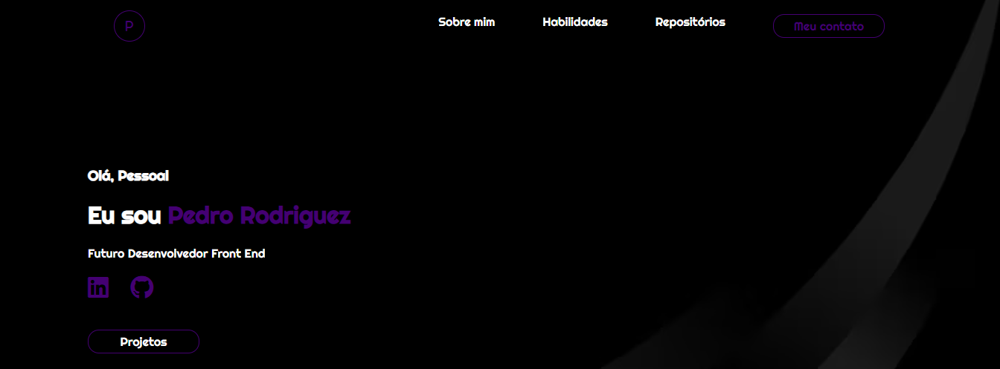
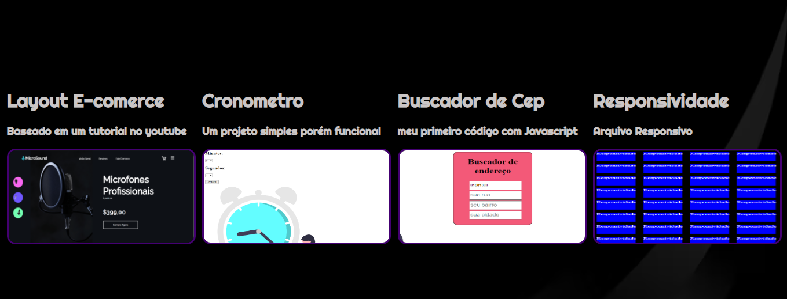
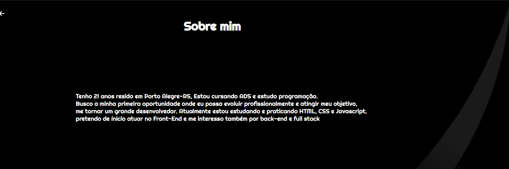
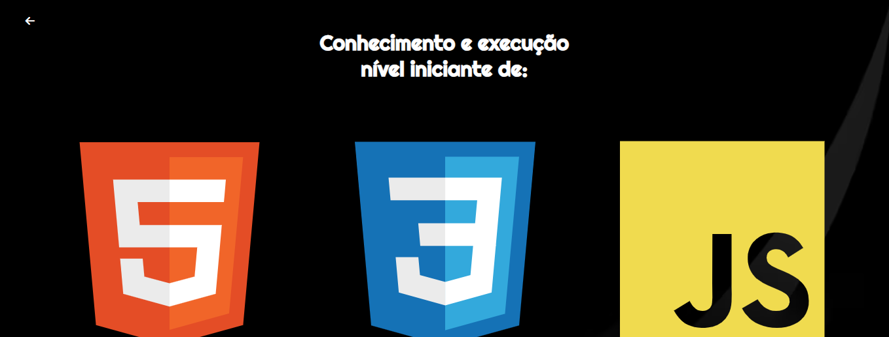

<h1>
  Meu Portfólio de desenvolvimento front-end
</h1>

 Depois de alguns dias elaborando, pesquisando e desenvolvendo cheguei ao final deste projeto que será meu portifólio para recrutadores 
Acredito que este projeto é resultado de muito estudo e dedicação que me fizeram chegar até aqui.
  Sei que o caminho é longo mas me dedicarei a fundo para seguir na profissão que eu amo 

<di> 

  
Optei por um layout bem simples mantendo sempre o propósito inicial

</di>

  
  
Fiz a linkagem da pagina com alguns projetos que escolhi em especial pois julgo que foram muito importantes para o meu aprendizado 
  Destaque em css, Destaque em Javascript e um arquivo totalmente responsivo

  <h1>Sobre mim</h1>
  
  
 Resolvi fazer esta parte sobre mim bem simples e objetiva sem target mas com acessibilidade 
  por meio de uma seta podemos voltar para a homepage.

  <h1>
    Habilidades
  </h1>
  

